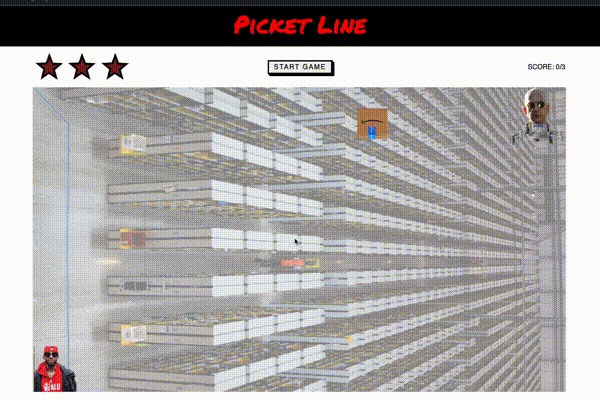

# Picket line game

My first project during the Ironhack Web Developer Bootcamp. It`s a trivial arcade game using plain javascript. Interactivity and Game Logic are implemented through Event Listeners, DOM Manipulation and Intervals.

It's responsive (at least on horizontal screens bigger then 600px).

## Gameplay

You are a union organizer. Try to reach as many workers before getting hit by killer packages from an evil billionaire.  

## Demo

You can try the game:
\
\
\
[![Button Click]][Link]

## Credits

+ Game Idea: @taube

+ Music: Two Good Men by Woody Guthrie

+ Sounds: freesound.org

+ Start game button: Button design by Michael McMillan

+ Evil Ideas: Ffej Sozeb
<!---------------------------------------------------------------------------->
[Button Click]: https://img.shields.io/badge/Play!-37a779?style=for-the-badge
[Link]: https://denefi.github.io/picket-line-game/
