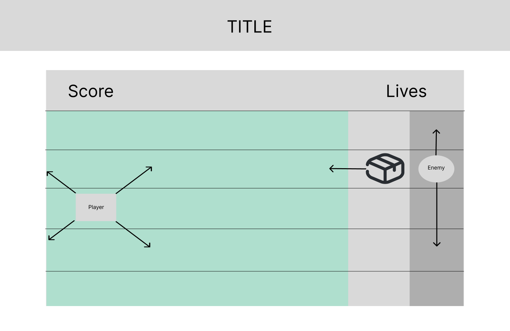

# Project description

You are working on a warehouse with horrible working conditions. So you and your friends decide to form a union. But your boss wants to stop you! Try to speak to as many collegues before he can hit you with an obstackle. 

# MVP

Implement player, throwing boss and one type of obstacle, collision mechanism and game over. 
Player with movement up and down using arrow keys. 
Boss with automatic moving and shooting. 

- [x] Initial Setup: A page with a 16:9 board that is defined with viewport 
- [ ] Start game button
- [ ] Game Over Page
- [ ] Game Class
  - Properties
    - Obstacles Array
    - player
    - enemy
    - board DOM Elm
  - Methods
    - Creates new Player
    - Creates new enemy
    - sets event listeners
    - intervalls
- [x] Player Class
  - Properties
    - size
    - position (x, y)
    - Player DOM Element
  - Methods
    - Append player to DOM
    - Move up 
    - Move Down
    - 
- [ ] Enemy Class
  - Properties
    - size
    - position (x, y)
    - Player DOM Element
  - Methods
    - Append enemy to DOM
    - Move up and d own automatically (and fluent)
    - Throw obstacle 
- [ ] Obstacle class
  - Properties
    - size
    - position (x, y)
    - Obstacle DOM Element
  - Methods
    - Append obstacle to DOM
    - append obstacle to array. 
    - check if out of board
    - delete
    - Move up and d own automatically (and fluent)
    - Throw obstacle 
  